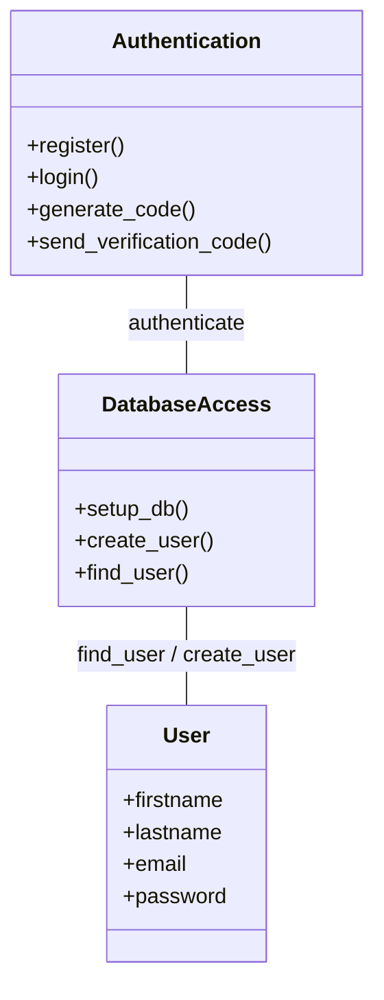
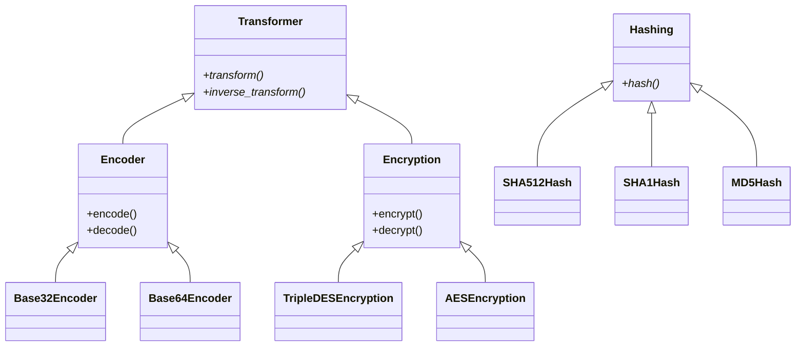

# security-toolbox

## Overview

- This is a small tool providing some basic security operations

## Description 

### Authentication & Signup 

### Hashing, Encoding & Symmetric encryption

### Asymmetric encryption

## Features

### Authentication & Signup

- User must sign up in order to use the tool (saved in a mongodb)
- supports 2 factor authentication

### Menu

1. Encoding / Decoding ()
2. Hashing
3. Brute forcing a hashed email
4. Symmetric Encryption / Decryption (AES, Triple DES)
5. Asymmetric Encryption / Decryption (RSA,ElGamal)
