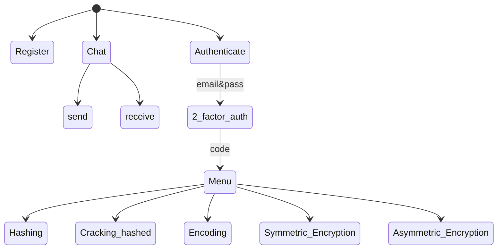
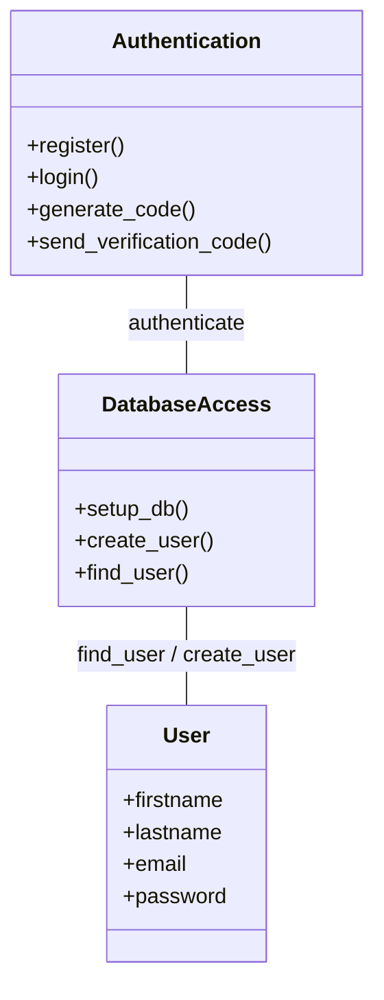
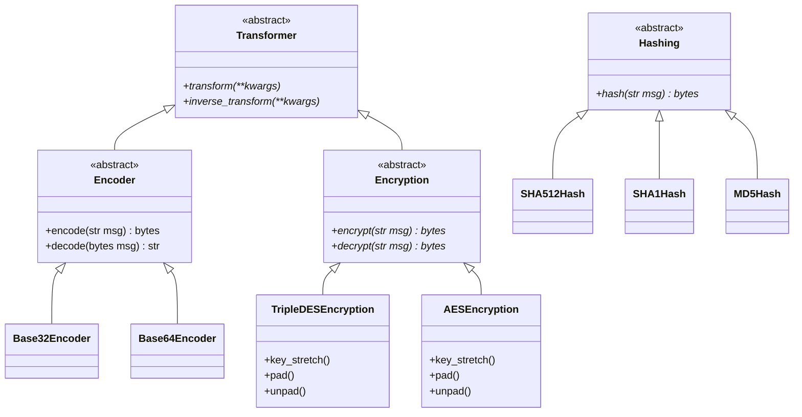
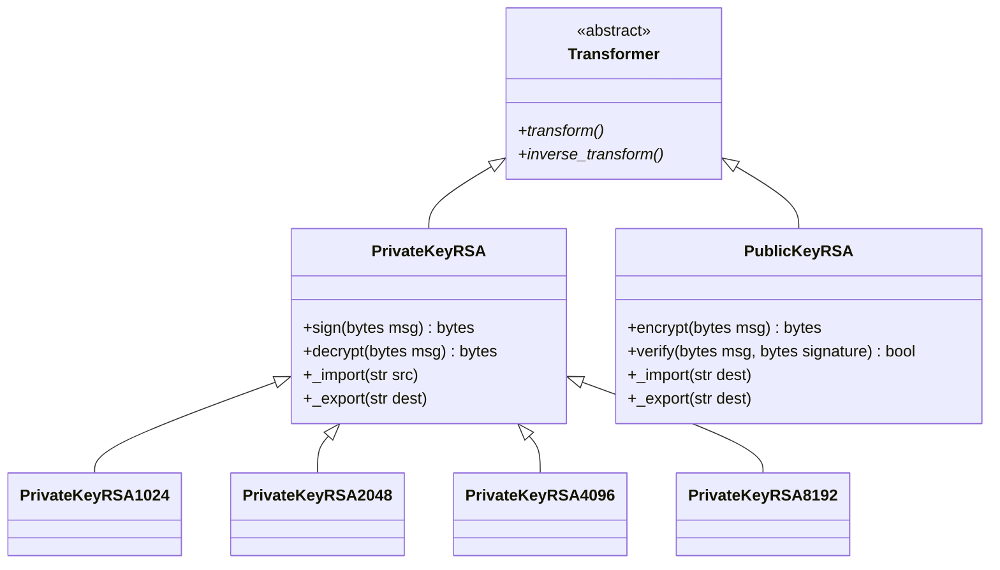
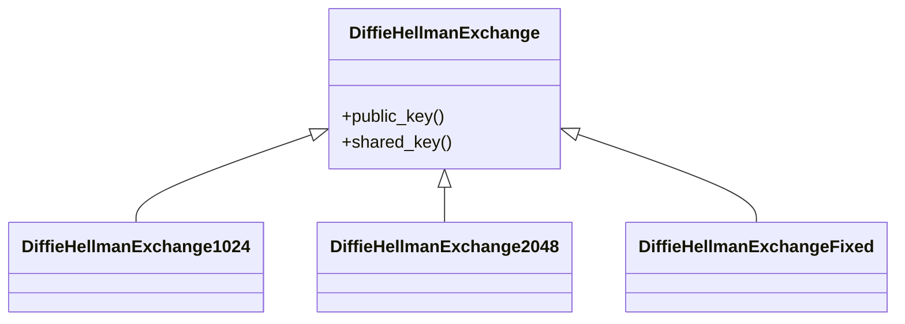
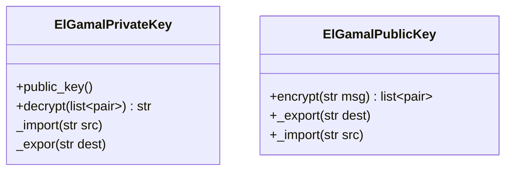
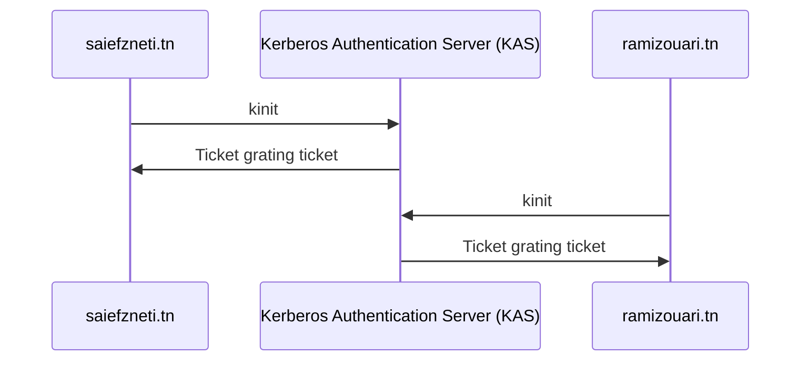
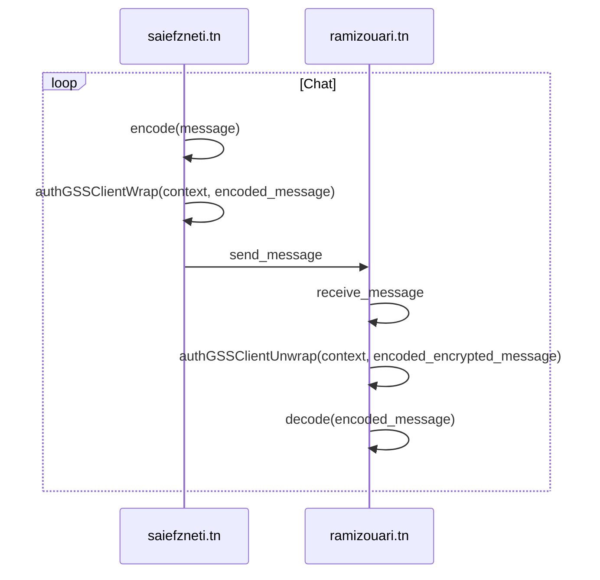

# Security Toolbox

## Overview

- This is a small tool providing some basic security operations (hashing, encryption, ...)

## Modelisation 

### General Flow




### Authentication & Signup 



### Hashing, Encoding & Symmetric encryption

- `Transformer` : An abstract class defining two main methods
  - `transform` : an operation on an input
  - `inverse_tranform` : the inverse of that operation
- `key_strech` : In order to be able to use a passphrase as our key for cryptographic operations, we're using a technique called **key stretching**. We're using the **Concat KDF algorithm**
  - **ConcatKDF** (Concatenation Key Derivation Function) is defined by the NIST  to be used to derive keys for use after a Key Exchange negotiation operation.
  - *Explication*: KDF hashes the concatenation of a 4-byte counter initialized at 1  (big-endian), the shared secret obtained by ECDH, and some other  information passed as input. The counter is incremented and the process  is repeated until enough data was produced. The concatenation of the  hashes, truncated as needed, forms the output to be used as key

- `pad / unpad`: When using AES or TripleDES for encryption , **the message needs to be multiple of Block Size**, we're using a know algorithm called **`PKCS7`** to perform the padding and unpadding to the appropriate size.



### Asymmetric encryption

#### RSA

This implementation is straight forward, we have two classes :

- `PrivateKeyRSA` : where we can `sign`and `decrypt` a message
- `PublicKeyRSA` : where we can `encrypt` and `verify` a message



#### Diffie Hellman



#### El Gamal

- Knowing that **The message should not be longer than the key**, when we encrypt we **divide** our message to multiple **blocks** shorter in length than the key. Then we encrypt each one individually, we then return the result as a list, the inverse operation is done when decrypting.



### Kerberos General Flow



 ```mermaid
 sequenceDiagram
   	par Prepare Client
   		saiefzneti.tn->>saiefzneti.tn: authGSSClientInit(saiefzneti.tn, securitytools@ramizouari.tn)
 		saiefzneti.tn->>Ticket Granting Server(TGS): Ask for ticket for ramizouari.tn
 		Ticket Granting Server(TGS)->> saiefzneti.tn: Ticket for to access ramizouari.tn
     end
     par Prepare Server
 		ramizouari.tn->>ramizouari.tn: authGSSClientInit(securitytools@ramizouari.tn)
 	end
 	alt Authentication
 		saiefzneti.tn->>saiefzneti.tn: authGSSClientStep(context) [ prepare ticket to send it]
 		saiefzneti.tn->>ramizouari.tn: send ticket
 		ramizouari.tn->>ramizouari.tn: authGSSServerStep(context, ticket)[ process ticket]
 		ramizouari.tn->>saiefzneti.tn: feedback
 	end
 ```





## Features

### Authentication & Signup

- User must sign up in order to use the tool (saved in a mongodb)
- supports 2 factor authentication

### Menu

1. Encoding / Decoding ()
2. Hashing
3. Brute forcing a hashed email
4. Symmetric Encryption / Decryption (AES, Triple DES)
5. Asymmetric Encryption / Decryption (RSA,ElGamal)
