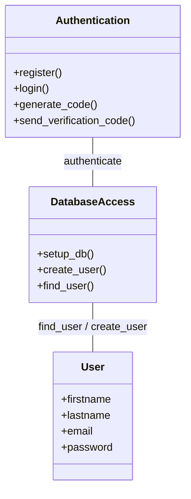
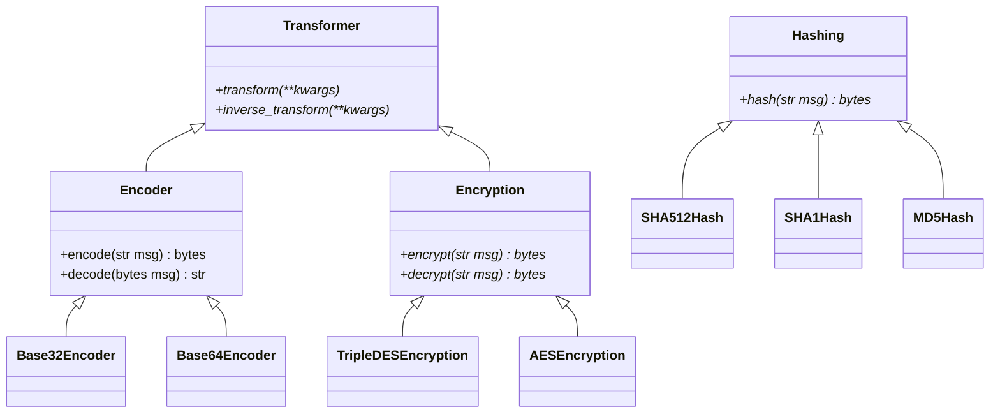
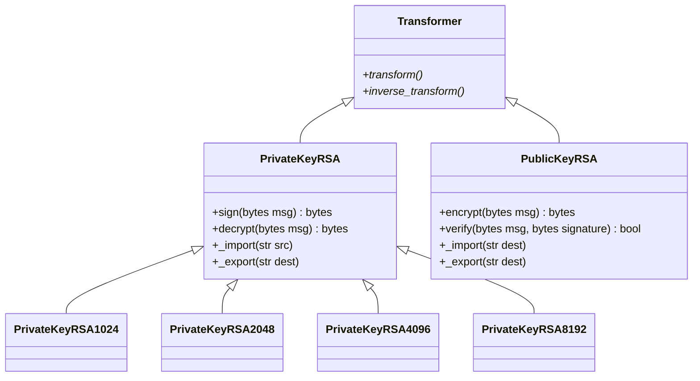

# security-toolbox

## Overview

- This is a small tool providing some basic security operations

## Description 

### Authentication & Signup 



### Hashing, Encoding & Symmetric encryption

- `Transformer` : An abstract class defining two main methods
  - `transform` : an operation on an input
  - `inverse_tranform` : the inverse of that operation



### Asymmetric encryption

#### RSA



#### Diffie Hellman

```mermaid
```


#### El Gamal

```mermaid
```


## Features

### Authentication & Signup

- User must sign up in order to use the tool (saved in a mongodb)
- supports 2 factor authentication

### Menu

1. Encoding / Decoding ()
2. Hashing
3. Brute forcing a hashed email
4. Symmetric Encryption / Decryption (AES, Triple DES)
5. Asymmetric Encryption / Decryption (RSA,ElGamal)
